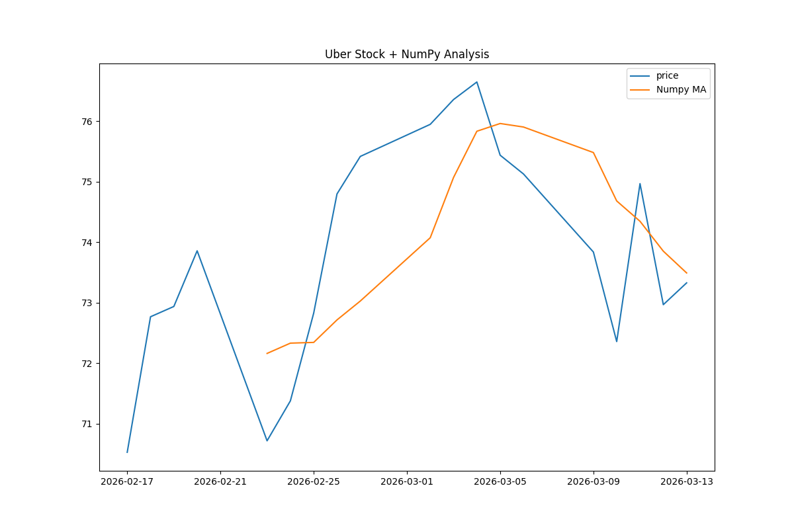

# 🚀 Uber Stock Dashboard

**NumPy + Pandas financial analysis dashboard** with **responsive HTML/CSS/JS frontend**. Real Uber stock data analysis.

## ✨ Features
- **NumPy calculations**: Daily returns, volatility, 5-day moving average
- **Pandas data processing**: CSV import/export 
- **Matplotlib charts**: Professional stock visualization
- **HTML/CSS/JS**: Interactive web dashboard
- **Real-time data**: Live Uber stock from Yahoo Finance

## 📊 Live Demo


## 🛠️ Tech Stack
Python | NumPy | Pandas | Matplotlib | HTML5 | CSS3 | Vanilla JavaScript
## 🚀 Quick Start
```bash
# 1. Install dependencies
pip install yfinance pandas numpy matplotlib

# 2. Run analysis
python UBERstock_dashboard.py

# 3. Open dashboard
dashboard.html  # Double-click in browser
📈 Key Analysis
Total Change: Auto-calculated from real data

Volatility: NumPy standard deviation

Returns: Logarithmic daily % change

MA: 5-day moving average trend

💼 Portfolio Ready
Perfect for Python Developer, Data Analyst, Full Stack roles.

Live Demo: Dashboard | Data

👨‍💻 Author
Pavan Torlapati - Python Developer
LinkedIn | Portfolio

📞 Hire Me
Contact for freelance Python projects! Upwork ready.
